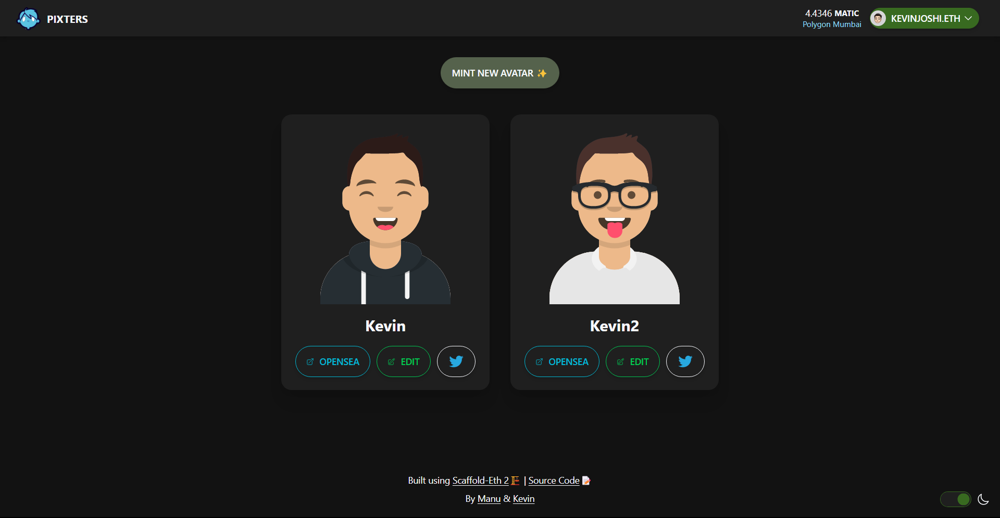
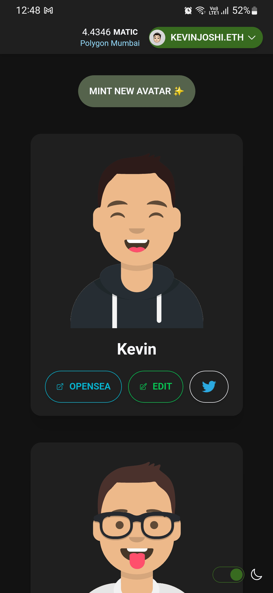
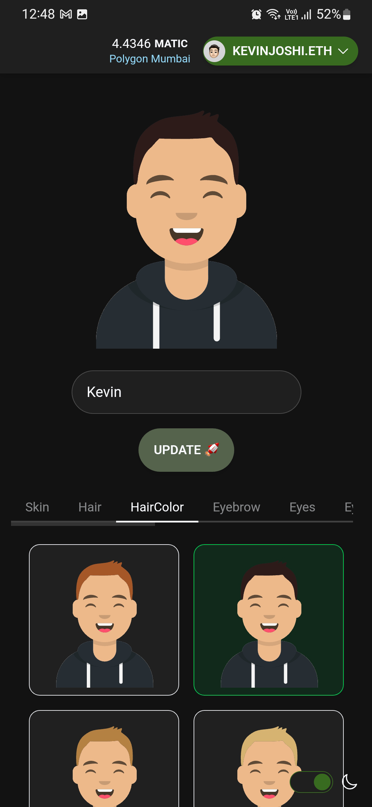

# PIXTERS

The idea behind Pixters is to allow user to mint dynamic avatars as NFTs 👾 Which they can customise all they want (even after minting ✨) and use them as PFPs on social or anywhere else that they would use a regular NFT.

Pixters gives you the freedom to mint an avatar just once and keep on customising it later as per your mood XD

Currently Pixters is live on Polygon & Polygon Mumbai 🚀

It is built using [scaffold-eth 2 🏗️](https://github.com/scaffold-eth/scaffold-eth-2)  

## Relevant Links

Short video explanation: [Introducing Pixters ✨](https://youtu.be/cBzQLe4X-kM)

### Polygon

- [Webapp](https://pixters.vercel.app/)
- [Smart contract](https://polygonscan.com/address/0xe3aD46c61fB0C845C93D070E73dCED68E47853FE)

### Polygon Mumbai

- [Webapp](https://pixter-oho7orjpf-distroinfinity.vercel.app/)
- [Smart contract](https://mumbai.polygonscan.com/address/0xcb65059572165773684ef5fe318ba301bf299583)

## Running this project

1. Clone the repository
2. Run the following command from the root of the project

```bash
yarn install
```

```bash
yarn start
```

> If you don't wish to interact with the polygon chain follow the steps below:

1. Clone the repository
2. In the [scaffold.config.ts](packages/nextjs/scaffold.config.ts) file change the `targetNetwork` property to `chains.hardhat`
3. Run the following command from the root of the project

```bash
yarn install
```

```bash
yarn chain
```

```bash
yarn deploy
```

```bash
yarn start
```

## Images

### Desktop


---


### Mobile Devices

|  |  |
|---|---|

### Original Avatar Design Credits
- React SDK for design SVGs: https://github.com/fangpenlin/avataaars
- Artist: https://twitter.com/pablostanley
